# VOD Master
VOD Synchronizer에서 VOD Master로 이름이 변경되었습니다. (2026.03.24)

<table align="center">
  <tr>
    <td style="">
      
    </td>
    <td style="">
      
SOOP 혹은 CHZZK VOD(다시보기) 시청 시 생방송 보듯이 다른 스트리머의 시점이나 채팅이 궁금할때 다른 스트리머의 VOD를 찾아서 볼 수 있게 해주는 크롬 확장 프로그램입니다.

    </td>
  </tr>
</table>

[핵심 기능](#핵심-기능) • [설치 방법](#설치-방법) • [QnA](#qna) • [알려진 문제](#알려진-문제) • [업데이트 내역](#업데이트-내역) • [라이선스](#라이선스)

## 핵심 기능
#### SOOP, CHZZK 다시보기 페이지에서 동작합니다.
- 우측 하단에 영상재생시점기준 당시의 시간을 보여줍니다. 
- 이 시간을 바꿔 입력하면 그 시간에 맞게 VOD의 재생시점을 바꿔서 **재생**합니다.
- 상단 기본 검색창에 스트리머를 검색하면 검색결과에 Sync VOD 버튼이 생기고 버튼을 누르면 해당 스트리머의 VOD에서 현재 재생 시점과 동일한 시점의 VOD를 찾아 새 탭에서 열어줍니다. (최초 실행 시 팝업 허용이 필요할 수 있습니다.)
- 우측 '타 플랫폼과 동기화' 버튼을 클릭하면 SOOP 스트리머를 검색하여 동기화할 수 있습니다.

#### 그 외 기능과 설명은 [여기](https://khassarion.github.io/VOD-Master/doc/index.html)서 확인하세요.

## 설치 방법

### 방법 1: Chrome Web Store에서 설치 (권장)
1. [Chrome Web Store](https://chromewebstore.google.com/detail/vod-master/fcgefghffdkgllcmgbckhiebjgcdppme)에서 VOD Master를 설치하세요.
2. "Chrome에 추가" 버튼을 클릭하여 설치를 완료하세요.

### 방법 2: GitHub Releases에서 다운로드 (개발자용 혹은 스토어에 게시되기전에 미리 체험용)
1. [이 저장소](https://github.com/Khassarion/VOD-Master)의 우측에 있는 [Releases](https://github.com/Khassarion/VOD-Master/releases)를 클릭합니다.
2. 원하는 버전의 릴리즈 Assets에서 VOD-Master_로 시작하는 zip파일을 다운로드합니다.
3. 다운로드한 ZIP 파일을 원하는 위치에 압축을 풉니다.
4. 크롬 브라우저에서 확장 프로그램 관리(chrome://extensions)로 이동합니다.
5. 우측 상단의 "개발자 모드"를 활성화합니다.
6. "압축해제된 확장 프로그램을 로드합니다" 버튼을 클릭하고, 압축을 푼 폴더를 선택합니다.

### 방법 3: TamperMonkey를 사용하는 경우 (SOOP 동기화만 지원)
1. [https://greasyfork.org/ko/scripts/541829-vod-master-soop](https://greasyfork.org/ko/scripts/541829-vod-master-soop)에서 스크립트를 설치하세요.

## QnA

### 1. 다시보기를 지우거나 해당 시간대의 다시보기가 없으면 어떡해요?
당연히 못 보는거죠 뭐. 없는걸 만들거나 다시보기를 저장해두는 서버가 있는 게 아니라 그냥 사용자 계정으로 대신 검색해주는 기능일 뿐입니다.

### 2. Sync VOD 버튼을 눌렀는데 실패했다고도 안뜨고 탭도 안 열려요.
주소 표시줄에 팝업 차단 표시가 있나요? 팝업을 허용해주세요.

## 알려진 문제
- CHZZK: 라이브가 매우 길어 다시보기가 3개 이상으로 나뉜 경우 타임스탬프가 어긋날 수 있습니다.
- SOOP-->CHZZK 동기화: 최근 CHZZK UI 가 새로 업데이트되어 패널 내 CHZZK 스트리머 검색창이 제대로 표시되지 않는 문제가 있습니다.

## 업데이트 내역
### 1.8.0.2 (2026.10.01)
- SOOP 다시보기 순 조회수 표시가 스크린모드 상태로 새로고침했을 때 적용되지 않던 문제를 수정했습니다.

### 1.8.0.1 (2026.09.30)
- 클립 탐색기 — **SOOP 전용**
  - 패널 안에 **새 창으로 보기** 버튼이 추가되어, 별도 창으로 분리해서 볼 수 있습니다.
  - 클립·캐치 목록이 이제 기본적으로 접힌 채로 열립니다.
  - 패널을 기존보다 더 작게 줄일 수 있습니다.
  - **몰린 곳**을 재생 시간/라이브 시각 선택 버튼 옆으로 옮겼습니다.

### 1.8.0.0 (2026.09.27)
- 새 기능: 클립 탐색기 — **SOOP 전용**

  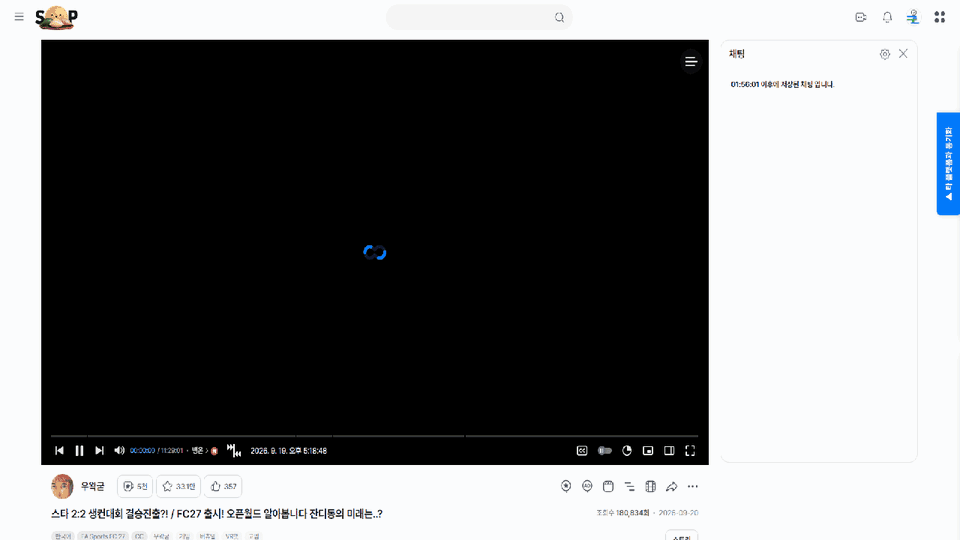

  - 다시보기 플레이어 페이지의 **유저 클립** 버튼 우측에 **클립 탐색기** 버튼이 생깁니다.
  - 이 다시보기에서 만들어진 클립·캐치가 다시보기의 어느 구간인지 시간축에 표시하고, 많이 겹친 곳(**몰린 곳**)을 알려줍니다.
  - 목록에서 여러 개를 골라 타임라인 댓글 형식으로 복사할 수 있습니다.
  - 설정에서 ON/OFF할 수 있습니다. (기본 ON)
  - [소개 페이지](https://khassarion.github.io/VOD-Master/doc/index.html#clipmap)
- 설정 화면: 저장 버튼이 항상 보이고, 저장하지 않은 변경사항이 있으면 안내합니다.

### 1.7.0.4 (2026.09.01)
- 클립이나 캐치와 연결된 다시보기를 시청할 권한이 없는 경우(구플전용 등) 라이브 당시시간이 올바르게 갱신되지 않던 문제를 수정했습니다.
- 로그 보기에서 Debug항목이 이제 기본 해제 상태입니다.

### 1.7.0.3 (2026.08.20)
- Github Repo의 소유자가 변경되어 이미지 소스 경로 등이 갱신되었습니다.

### 1.7.0.2 (2026.08.14)
- 최초 설치 알림과 업데이트 알림이 같이 발생하던 문제를 수정했습니다.

### 1.7.0.1 (2026.08.14)
- 편집 VOD 게시하기 모달 창 생성을 실패하던 문제를 수정했습니다.
- 편집 VOD 게시 대상에 일부 게시판이 표시되지 않던 문제를 수정했습니다.

### 1.7.0.0 (2026.08.14)
- 새 기능: 라이브 중 VOD 시청 알림 — **SOOP 전용**
  - VOD Master를 켠 채 **라이브 중인 본인**이 클립·캐치·편집·업로드 VOD를 **음소거 해제** 상태로 보면, 업로더에게 시청 시작을 알려 줍니다.
  - 알림 방식: **UP 하기**(기본 ON) · **댓글 등록**(기본 OFF, 문구 변경 가능)
  - 설정에서 ON/OFF 가능. 알림 후 우측 하단 안내 제공.
  - [소개 페이지](https://khassarion.github.io/VOD-Master/doc/live_watch_notify_intro.html)
- 새 기능: 다음 영상 자동 재생 방지 — **SOOP 전용**
  - VOD 재생이 끝날 때 다음 영상으로 자동으로 넘어가지 않게 합니다. (다른 페이지 삽입된 VOD 포함)
  - VOD 재생 바의 자동 재생 활성화/비활성화 설정과 별개로 동작합니다.

    
  - 설정에서 ON/OFF할 수 있습니다. (기본 ON)
- 이제 설정 창은 항상 새 탭에서 열립니다.
- 이제 최초 설치 시 설치 완료 안내(기능 설명 문서·설정 페이지 새 탭 버튼) 제공

### 1.6.1.5 (2026.07.26)
- 버그 수정
  - 시네티 등으로 잘린 다시보기와 연결된 클립이나 캐치에서 라이브 등시 시간이 잘못 계산되던 문제를 수정했습니다.
  
### 1.6.1.4 (2026.07.19)
- 버그 수정
  - CHZZK 업데이트로 CHZZK과 동기화하는 버튼이 생성되지 않던 문제를 수정했습니다.
  
### 1.6.1.2, 1.6.1.3 (2026.07.12)
- 버그 수정
  - SOOP VOD 동기화가 올바르지 않게 동작할 수 있는 문제를 수정했습니다.

### 1.6.1.1 (2026.07.07)
- 버그 수정
  - SOOP 이전 채팅 복원 로직 개선
  - 확장 프로그램 로드 시점 안정화

### 1.6.1.0 (2026.06.25)
- 새 기능: SOOP 다시보기 순 조회수 표시
  - 다시보기의 경우 조회수 숫자에 마우스를 올리면 순 조회수가 표시됩니다. 
  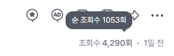
- 이전 채팅 복원
  - 재생 시점이 바뀌어 복원 버튼이 생성될 때 **1회 자동 복원**하는 옵션이 추가되었습니다. (기본값: 사용 안 함)
  - 자동 복원 사용 여부와 자동 복원 구간은 설정(⚙️)에서 조절할 수 있습니다. 
  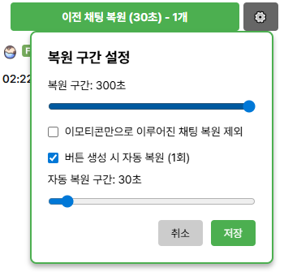
- 버그 수정
  - [타 플랫폼과 동기화] CHZZK 검색창이 보이지 않던 문제를 수정했습니다.

### 1.6.0.1 (2026.04.26)
- 버그 수정
  - 탬퍼몽키 스크립트에서 VOD 편집 인터페이스의 시간 갱신 주기가 지나치게 느렸던 문제를 수정했습니다.

### 1.6.0.0 (2026.04.05)
- 새 기능: 개선된 편집 VOD 인터페이스
  - 편집VOD 만들기를 누르면 공식 편집기 페이지가 열리지 않는 대신 더 나은 편집기 인터페이스가 나타납니다.
  - 기존의 불편했던 부분들을 개선하였습니다.
  - 자세한 사용 방법은 [문서 페이지](https://khassarion.github.io/VOD-Master/doc/index.html#veditor)에서 확인해주세요.
- 버그 수정
  - SOOP 게시글 작성 페이지에서 오류가 발생하던 문제를 수정했습니다.
  
### 1.5.7.1 (2026.03.25)
- 버그 수정
  - 전역 동기화가 동작하지 않던 문제를 수정했습니다.

### 1.5.7 (2026.03.24)
- 본 프로그램의 이름이 VOD Synchronizer에서 VOD Master로 변경되었습니다.
- 2026.3.24(화) SOOP 도메인 업데이트에 대응했습니다.
- 버그 수정
  - [SOOP] 편집VOD로 제작된 VOD에 대해 이전 채팅 복원 기능이 동작하지 않는 문제를 수정했습니다.
  - [SOOP] VOD가 전체 공개가 아닌 경우 오류가 발생하는 문제를 수정했습니다.

### 1.5.5 (2026.03.18)
- 핫픽스: 치지직에서 동기화를 시도할 때 오류가 발생하는 문제를 수정했습니다.

### 1.5.4 (2026.03.??)
- 이제 마이너 패치 이상일 경우에만 업데이트 알림이 표시됩니다.

### 1.5.3 (2026.03.16)
- 타임라인 편집기
  - 쉬프트를 누른채로 미세조정 시 10초씩 증감됩니다.
  - 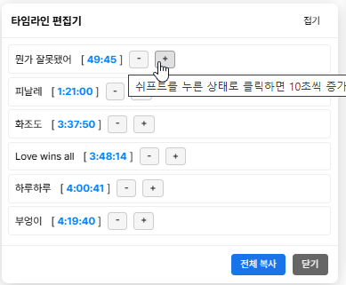
- 새 기능: 현재 시간 삽입
  - VOD 댓글 작성 및 수정 시 VOD의 현재 시점을 댓글 내용에 타임라인 형식으로 삽입합니다.
  - 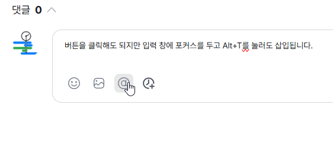
  
### 1.5.2 (2026.03.03)
- 새 기능: 타임라인 편집
  - 기존 기능인 타임라인 댓글 동기화 시 타임라인을 수정하고 복사하는 기능을 동기화하지 않고도 일반 댓글의 내용으로부터 가져올 수 있게 타임라인 편집 기능을 추가했습니다.
  - 타임라인이 포함된 댓글의 더보기 옵션(점 세개)을 누르면 타임라인 편집 버튼이 나타납니다. 
  
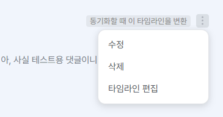  |  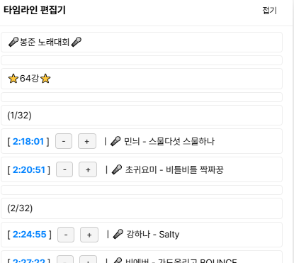
:-------------------------:|:-------------------------:
타임라인 편집 옵션 버튼            |  타임라인 편집기

- 이전 채팅 복원
  - 이제 다음 영상 복원 구간이 0초에 도달하면 버튼이 비활성화됩니다.
- 버그수정
  - 복원된 이전 채팅이 발생한 시점으로 이동하는 기능이 채팅 전체 범위에 적용되던 문제를 수정했습니다.
  
### 1.5.0 (2026.02.22)
- 새 기능: 타임라인 댓글 동기화
  - 타임라인 댓글을 다른 스트리머 다시보기와 동기화할 때 변환할 수 있는 기능이 추가되었습니다.
  - 타임라인이 포함된 댓글의 우측상단에 표시된 `동기화할 때 이 타임라인을 변환`을 클릭하여 활성화하고 동기화를 진행하면 동기화된 다시보기 페이지에서 변환된 타임라인 댓글을 확인하고 미세조정, 복사를 할 수 있습니다. 아직은 SOOP에서만 가능합니다.
  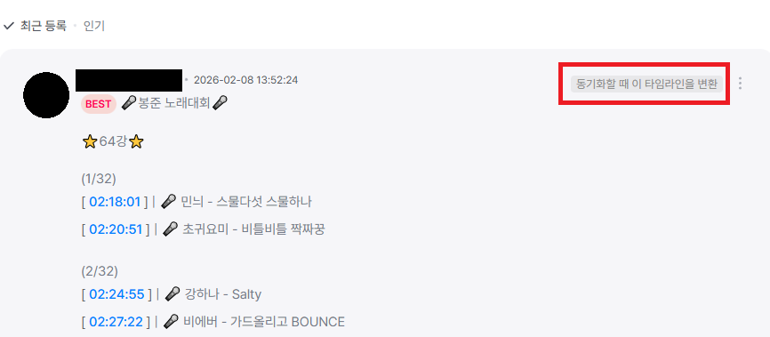
- 이전 채팅 복원
  - 설정에서 이모티콘만으로 구성된 채팅은 제외할 수 있는 기능이 추가되었습니다.
  - 이제 복원된 채팅에 마우스를 올리면 표시되는 `~초 전` 툴팁을 클릭하여 해당 채팅이 발생한 시점으로 이동할 수 있습니다.
- 버그수정
  - SOOP에서 다른 VOD로 변경되었을 때 기존 타임스탬프가 사라지던 문제를 해결했습니다.
  - 일부 VOD에서 타임스탬프 오류가 발생하던 문제를 수정했습니다.

### 1.4.0 (2026.01.28)
- [SOOP 새 기능] 이전 채팅 내역 복원
  - VOD를 재생한 시점의 이전 채팅 내역을 불러올 수 있습니다.
  - 복원 구간을 설정할 수 있습니다. (기본 30초)
  - 복원 버튼에 커서를 올리면 다음 복원 구간이 표시됩니다.
  - 채팅 내 시그니처 이모티콘과 기본 이모티콘, ogq가 지원됩니다.
  - 최대한 데이터를 분석하여 구독 이모티콘, 팬클럽 열혈팬 서포터 매니저 뱃지가 알맞게 표시되도록 했지만 제 나름대로 분석한거라 사실과 다를 수 있습니다. 스트리머 채팅은 아직 분석하지 않아서 정상적으로 표시되지 않을 것입니다.(닉네임과 채팅은 올바르게 표시됩니다) 

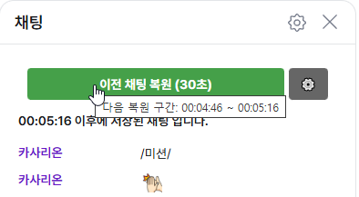  |  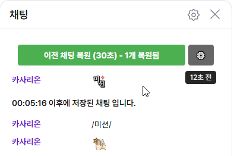 | 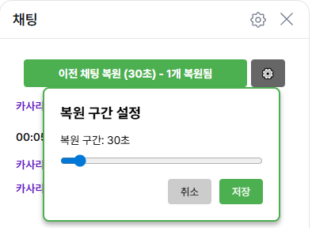
:-------------------------:|:-------------------------:|:-------------------------:
이전 채팅 복원 버튼            |  이전 채팅 복원 후 | 이전 채팅 복원 설정

  
- 타임스탬프와 전역 동기화 버튼의 위치가 우 하단 고정에서 vod 플레이어 재생 바 중간으로 변경되었으며 입력이 없을 때 완전히 투명해집니다.

SOOP | 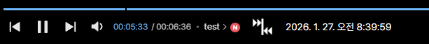
:-------------------------:|:-------------------------:
CHZZK | 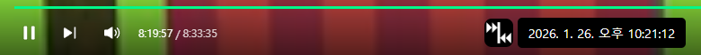

  
- 이제 동기화 성공 시 검색창을 깔끔하게 정리합니다.
- [버그수정]
  - CHZZK 페이지에서 SOOP 스트리머를 검색하기위한 창이 제대로 초기화되지않던 문제를 수정했습니다.

### 1.3.2 (2025.12.02)
- 편의성 개선: 검색창에 동기화 대상 스트리머를 입력하고 Ctrl+Shift+Enter를 누르면 첫 번째 SyncVOD 버튼을 자동으로 클릭합니다.
- 타임스탬프 부분에 커서를 올리면 도움말 툴팁을 띄웁니다.
- 이제 타임스탬프 수정 시 방향키를 눌러도 vod의 앞/뒤로 가기 기능이 동작하지 않습니다.
- 타임스탬프 텍스트를 복사할 때 텍스트데이터만 복사됩니다. (배경,글자 색상 X)
- CHZZK VOD 플레이어에 페이지를 로딩할 때 저장된 설정값이 제대로 적용되지 않는 문제를 해결했습니다.

### 1.3.1 (2025.11.02)
- 이제 `Sync VOD` 버튼을 누르고 동기화 가능한 다시보기가 발견되면 자동으로 검색영역이 닫힙니다.
- CHZZK에서 pip상태가 된 다시보기를 닫았을 때 동기화를 시도할 수 있었던 문제를 수정했습니다.
- VOD가 없는 상태에서 동기화를 시도할 수 있던 문제를 수정했습니다.
- VOD 페이지를 벗어낫음에도 전역동기화 버튼이 남아있던 문제를 수정했습니다.

### 1.3.0 (2025.10.27)
- SOOP --> CHZZK 동기화 기능이 추가되어 플랫폼 간 양방향 동기화가 가능합니다.
- `SOOP과 동기화` 패널과 `CHZZK과 동기화` 패널이 `타 플랫폼과 동기화` 패널로 통합되었습니다.
- 전역 동기화 버튼이 추가되었습니다. 해당 VOD를 기준으로 나머지 열려있는 VOD들을 동기화합니다.
- VOD 페이지를 벗어나는 경우 전역동기화 버튼이 남아있던 문제를 수정했습니다.

- CHZZK과 동기화하는 로직이 개선되어 동기화 시간이 단축되었습니다.
- SOOP의 타임스탬프를 방송시간 외의 시간으로 설정할 수 있던 문제를 수정했습니다.
- 이제 SOOP에서도 vod 플레이어 페이지에서만 패널들이 표시됩니다.

### 1.2.4 (2025.10.14)
- 간혹 스크립트 로드 순서가 꼬여 기능이 동작하지 않던 문제를 수정했습니다.

### 1.2.3 (2025.10.09)
- SOOP의 파생된 VOD(클립, 캐치)에서 타임스탬프를 수정하여 특정시간대로 이동하는 기능이 제대로 동작하지 않던 문제를 수정했습니다.
- 간단한 반복 재생 설정 기능을 추가했습니다. VOD 플레이어의 설정을 누르면 반복 재생 메뉴가 추가됩니다.

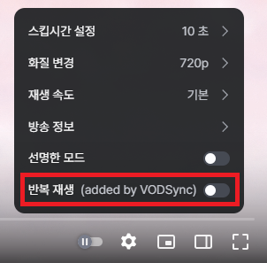

- 이제 업데이트 시 1회에 한하여 업데이트 내역을 표시합니다.

### 1.2.2 (2025.10.09)
- 동기화된 SOOP 다시보기가 열리고 재생되는 시간이 조?금 단축되었을 수도 있습니다.
- 편집된 다시보기를 동기화할때 제대로 계산하여 동기화하지 못하던 문제를 수정했습니다.
- 업로드된 VOD에서 동기화를 시도하는 경우 에러가 발생하는 문제를 수정했습니다.

### 1.2.1 (2025.10.04)
- 콘솔창에 에러메시지가 뜨는 문제를 해결했습니다.

### 1.2.0
- SOOP 스트리머와의 동기화 속도가 개선되고 더 이상 여러 탭이 열리지 않고 동기화 가능한 다시보기만 열립니다.
- 이제 SOOP의 클립, 캐치도 연결된 원본 다시보기가 존재한다면 라이브 당시 시간을 표시하고 동기화가 가능합니다. 다만 SOOP 자체의 문제점으로 수초의 오차가 발생할 수 있습니다.
- SOOP에서 표시되는 타임스탬프를 수정하면 더이상 페이지가 새로고침되지 않고 즉시 해당 시점으로 점프합니다.
- 이제 같이보기 등으로 편집된 SOOP 다시보기도 라이브 당시 시간을 정상적으로 표시합니다. (잘 안되면 제보바람)
- CHZZK에서 SOOP 스트리머와 동기화할 때 SOOP 검색을 누르고 난 이후에 치지직 다시보기의 시점을 반영하여 동기화하지 않던 문제를 해결했습니다.
- 버튼 텍스트가 FindVOD에서 SyncVOD로 변경되었습니다.

### 1.1.3 (2025.09.29)
- 1.1.2에서 발생한 설정 저장 오류 문제를 수정했습니다.

### 1.1.2 (2025.09.25)
- 더 이상 사용되지 않는 SOOP 방송국 도메인을 제거했습니다. (ch.sooplive.co.kr)
- 방송국 UI 마이너 업데이트로 인해 동기화가 동작하지 않던 문제를 해결했습니다.
- 이제 SOOP 동기화 시 검색결과에 따라 추가 검색을 시도합니다.

### 1.1.1 (2025.09.18)
- 동기화할 SOOP 다시보기가 없는 경우 스크립트가 멈추는 현상을 수정했습니다.

### 1.1.0
- SOOP 방송국 페이지가 리뉴얼됨에 따라 SOOP 다시보기를 검색하는 로직이 업데이트되었습니다.
- 문의를 위한 1:1오픈채팅방을 개설했습니다. 설정페이지에서 문의하기를 눌러보세요.

### 1.0.1
- 다른 스크립트와 충돌할 가능성이 있는 부분을 수정했습니다.

### 1.0.0
- Chrome 웹 스토어에 게시

### 0.0.9.3
- CHZZK 동기화 기능 개선 및 안정성 향상
- 타임스탬프 툴팁 투명화 기능 개선
- iframe 통신 프로토콜 최적화
- 에러 처리 및 로깅 시스템 개선

### 0.0.9
- CHZZK 동기화를 지원합니다. 다시보기를 시청할때 치지직 기본 검색창에 스트리머를 검색하면 Sync VOD 버튼이 생성됩니다. 누르면 동기화가능한 VOD를 찾습니다. 
**<code>주의사항: chzzk은 다시보기를 기간을 지정하여 검색하는 기능이 없으므로 실제시간과 동기화를 요청한 시간의 차이가 크면 시간이 조금 소요될 수 있습니다. 또한 비공식 치지직 api를 사용하므로 치지직 스트리머와 동기화를 너무 빠르게 시도하는 경우 네이버에서 조치를 취할 수 있습니다.</code>**
- CHZZK VOD 플레이어페이지에서 SOOP 스트리머를 검색하여 동기화할 수 있습니다. 우측 파란 버튼을 눌러 사용할 수 있습니다.
- 키보드 마우스 입력이 2초이상 없거나 마우스가 페이지 밖을 벗어나면 타임스탬프 툴팁이 거의 투명화됩니다.
### 0.0.8
- 최초 배포됨

## 라이선스

이 프로젝트는 MIT 라이선스를 따릅니다. 자세한 내용은 `LICENSE` 파일을 참고하세요. 
